# MoodMirror — AI Emotional Intelligence Companion

> A multimodal mental-health companion that *measures* whether it actually helps you.

MoodMirror reads how you feel from text, voice, and face, then reflects it back through a Gemini-powered companion ("Mirror"), a real Digital Twin grounded in your time-series, and a calm safety flow that fires when distress signals are real. Privacy controls aren't decoration — every toggle has a real consequence in the engine.

Built for **Team CodeZilla**.

---

## What it actually does (8 shipped features)

| # | Feature | Status |
|---|---|---|
| 1 | **Emotion Intelligence Engine** — one Gemini call fuses text + voice + face + your last 14 days into a canonical reading with `stress_score`, `burnout_risk`, `emotional_volatility`, `cognitive_load`, `crisis_probability`. Volatility is computed deterministically from history stddev — Gemini doesn't get to make up statistics. | ✅ |
| 2 | **Mirror — Reflective Gemini companion** with memory. Reads your last 6 emotion readings + 12 chat turns. Validates first, asks one clarifying question at a time, refuses to diagnose, matches your language. | ✅ |
| 3 | **Crisis Intelligence System** — 4-tier classifier (`none`/`watch`/`elevated`/`crisis`) layered conservatively: hard keyword tripwire → soft signals + history → optional Gemini classifier (raises only). Calm modal UI: breathing, 5-4-3-2-1 grounding, region-aware helplines. | ✅ |
| 4 | **Digital Twin 2.0** — replaced a hardcoded `switch(mood)` with a real two-layer engine. Resilience score 0–100 (composite of avg stress, recovery speed, crisis history, check-in streak). Trigger words, by-hour analysis, 7-day forecast, ranked coping recommendations. Honest empty state when `n_readings < 5`. | ✅ |
| 5 | **Analytics Dashboard** — historical slices: weekly resilience trend, 7×24 stress heatmap, **Mirror effectiveness** (avg pre/post-chat stress delta — *measurable AI impact*), this-week vs last-week emotion shift, crisis events sparkline, recovery time-to-baseline. **Zero Gemini, all real numbers.** | ✅ |
| 6 | **Smart Support Network** — severity score with explicit factors. Three audience-tailored narratives via one Gemini call (friend / family / therapist) with severity-driven escalation. Per-contact share modal with `tel:` / `sms:` / `wa.me` deep links. | ✅ |
| 7 | **Privacy + AI Ethics Layer** — six consent toggles with **real consequences** (a disabled modality is stripped from the Gemini call entirely; `allow_text_storage=false` keeps metrics + emotion but drops the raw text). Transparency log surfaces every reading's reasoning. One-click data export and double-confirm delete. | ✅ |
| 8 | **Hyper-Personalization** — language, culture, age, spirituality. One central `cultural_block` injects into Mirror, Twin, and Support prompts. Region-aware helplines (India / US / UK / global fallback). | ✅ |

### What we deliberately did NOT ship (called out honestly in the demo)

| | Why not |
|---|---|
| Micro-expression detection, blink frequency | Would need real CV training data we don't have. We do have *real* face emotion via Gemini Vision instead. |
| Voice-to-voice Gemini Live | Fragile in live demos. We have real voice analysis via Gemini multimodal. |
| Wearables / calendar / screen-time integrations | Need real device accounts; can't be faked in a hackathon. |
| Encrypted-at-rest emotional data | Would need real key management. We chose not to make a claim we can't back up. |
| React Native + smartwatch app | Second codebase; multi-week. |

---

## Architecture

```mermaid
flowchart TB
    subgraph Client["Browser (Next.js 15 · React 18 · Tailwind)"]
        D["/dashboard<br/>text · voice · face capture"]
        M["/mirror<br/>chat with memory"]
        T["/digital-twin<br/>resilience + forecast"]
        A["/analytics<br/>heatmap · trends · effectiveness"]
        S["/support<br/>severity + share"]
        P["/privacy<br/>consent · transparency · export"]
        Pr["/profile<br/>language · culture · age"]
        CM["CrisisModal<br/>breathing · grounding · reach out"]
    end

    subgraph API["FastAPI · backend/routes/"]
        AnR["/api/analyze"]
        MiR["/api/mirror"]
        CrR["/api/crisis"]
        TwR["/api/digital_twin"]
        AnaR["/api/analytics"]
        SuR["/api/support"]
        PrR["/api/privacy"]
        ProR["/api/profile"]
    end

    subgraph Engines["Engines · backend/utils/"]
        EE["emotion_engine.py<br/>fuse → metrics + emotion"]
        MiE["mirror.py<br/>Gemini multi-turn"]
        CrE["crisis.py<br/>3-layer classifier<br/>+ event log"]
        TwE["digital_twin.py<br/>profile + insights"]
        AnaE["analytics.py<br/>weekly · heatmap<br/>· Mirror impact"]
        SuE["support_intel.py<br/>severity + 3-tone<br/>narratives"]
        PrE["privacy.py<br/>consent · export · delete"]
        ProE["personalization.py<br/>cultural_block<br/>regional_helplines"]
    end

    subgraph Data["Firebase Realtime DB"]
        Re["readings/{uid}<br/>canonical time-series"]
        Rp["reports/{uid}<br/>legacy + raw text"]
        Ms["mirror_sessions/{uid}"]
        Ce["crisis_events/{uid}"]
        Sc["support/{uid}"]
        Up["user_prefs/{uid}<br/>consent + profile"]
    end

    subgraph Ext["External"]
        FA["Firebase Auth<br/>ID token verify"]
        GE["Gemini 1.5 Flash<br/>multimodal · text"]
    end

    D --> AnR --> EE
    M --> MiR --> MiE
    T --> TwR --> TwE
    A --> AnaR --> AnaE
    S --> SuR --> SuE
    P --> PrR --> PrE
    Pr --> ProR --> ProE
    CM --> CrR --> CrE

    EE -->|classify| CrE
    EE -->|consent gate| PrE
    MiE -->|classify + log| CrE
    MiE -->|consent gate| PrE
    MiE -->|cultural_block| ProE
    TwE -->|cultural_block| ProE
    SuE -->|cultural_block| ProE
    AnaE -->|weekly resilience| TwE
    CM -->|regional helplines| ProE

    EE --> Re
    EE --> Rp
    MiE --> Ms
    CrE --> Ce
    SuR --> Sc
    PrE --> Up
    ProE --> Up

    TwE --> Re
    TwE --> Ce
    TwE --> Rp
    AnaE --> Re
    AnaE --> Ce
    AnaE --> Ms
    SuE --> Re
    SuE --> Ce
    MiE --> Re
    CrE --> Re

    API -.->|Bearer token| FA
    EE -.->|fusion| GE
    MiE -.->|chat| GE
    CrE -.->|classify + summary| GE
    TwE -.->|insights| GE
    SuE -.->|3-tone narrative| GE

    classDef pageStyle fill:#dbeafe,stroke:#2563eb,color:#1e40af
    classDef apiStyle fill:#e0e7ff,stroke:#6366f1,color:#3730a3
    classDef engineStyle fill:#fef3c7,stroke:#d97706,color:#92400e
    classDef dataStyle fill:#dcfce7,stroke:#16a34a,color:#14532d
    classDef extStyle fill:#fce7f3,stroke:#db2777,color:#831843
    class D,M,T,A,S,P,Pr,CM pageStyle
    class AnR,MiR,CrR,TwR,AnaR,SuR,PrR,ProR apiStyle
    class EE,MiE,CrE,TwE,AnaE,SuE,PrE,ProE engineStyle
    class Re,Rp,Ms,Ce,Sc,Up dataStyle
    class FA,GE extStyle
```



### Why it's structured this way

- **One reading shape, many consumers.** The Engine is the only thing that writes `readings/{uid}`. Twin, Analytics, Support Intel, and Crisis all *read* from it. No duplicated math.
- **Crisis is one classifier, called from everywhere.** Engine and Mirror both call `crisis.classify()` so the safety UX is consistent.
- **Personalization is one prompt block.** `cultural_block(profile)` is injected by Mirror, Twin, and Support. Adding a new dimension means editing one file.
- **Privacy gates are at the persistence boundary.** Consent flags don't live in the UI — the Engine, Mirror, and Crisis modules consult `privacy.get_consent()` *before* writing.
- **Determinism vs. Gemini, on purpose.** Resilience score, volatility, recovery time, severity score, weekly aggregates, Mirror effectiveness — all deterministic math. Gemini handles narrative + multi-turn conversation only.

---

## Setup

### Prerequisites

- **Python 3.10+**
- **Node 18+** (Next.js 15 needs it)
- **Firebase project** with Realtime Database + Auth (email/password is enough)
- **Google AI Studio API key** for Gemini → https://aistudio.google.com/app/apikey

### 1. Clone

```bash
git clone https://github.com/Rishiraj-1/Team_CodeZilla_MoodMirrorAI.git
cd Team_CodeZilla_MoodMirrorAI
```

### 2. Backend

```bash
cd backend
python -m venv .venv
source .venv/bin/activate          # Windows: .venv\Scripts\activate
pip install -r requirements.txt
```

Create **`backend/.env`** with:

```env
# Gemini
GOOGLE_API_KEY=your_gemini_api_key_here
GOOGLE_MODEL=gemini-1.5-flash      # optional; this is the default

# Firebase Admin SDK
GOOGLE_APPLICATION_CREDENTIALS=firebase-key.json
FIREBASE_PROJECT_ID=your-firebase-project-id
FIREBASE_DB_URL=https://your-project-default-rtdb.firebaseio.com
```

Drop your Firebase service-account JSON at **`backend/firebase-key.json`** (or anywhere — point `GOOGLE_APPLICATION_CREDENTIALS` at it).

Run the API (from the repo root, not `backend/`):

```bash
cd ..
uvicorn backend.main:app --reload --port 8000
```

You should see:
```
Uvicorn running on http://127.0.0.1:8000
```

### 3. Frontend

```bash
cd Frontend
npm install
```

Create **`Frontend/.env.local`** with:

```env
NEXT_PUBLIC_BACKEND_URL=http://127.0.0.1:8000

# Firebase web SDK (from your Firebase Console → Project settings → Web app)
NEXT_PUBLIC_FIREBASE_API_KEY=...
NEXT_PUBLIC_FIREBASE_AUTH_DOMAIN=your-project.firebaseapp.com
NEXT_PUBLIC_FIREBASE_PROJECT_ID=your-firebase-project-id
NEXT_PUBLIC_FIREBASE_DATABASE_URL=https://your-project-default-rtdb.firebaseio.com
NEXT_PUBLIC_FIREBASE_STORAGE_BUCKET=your-project.appspot.com
NEXT_PUBLIC_FIREBASE_MESSAGING_SENDER_ID=...
NEXT_PUBLIC_FIREBASE_APP_ID=...
```

Run the dev server:

```bash
npm run dev
```

Open http://localhost:3000.

### 4. Firebase Realtime Database rules (development)

Paste these into the **Realtime Database → Rules** tab. Locks each user to their own paths:

```json
{
  "rules": {
    "readings":        { "$uid": { ".read": "$uid === auth.uid", ".write": "$uid === auth.uid" } },
    "reports":         { "$uid": { ".read": "$uid === auth.uid", ".write": "$uid === auth.uid" } },
    "mirror_sessions": { "$uid": { ".read": "$uid === auth.uid", ".write": "$uid === auth.uid" } },
    "crisis_events":   { "$uid": { ".read": "$uid === auth.uid", ".write": "$uid === auth.uid" } },
    "support":         { "$uid": { ".read": "$uid === auth.uid", ".write": "$uid === auth.uid" } },
    "user_prefs":      { "$uid": { ".read": "$uid === auth.uid", ".write": "$uid === auth.uid" } }
  }
}
```

> The Admin SDK on the backend bypasses these rules; they protect direct client reads.

---

## Usage / Demo Script

> **Best demo flow** — about 5 minutes. Have a clean account.

1. **`/login`** → sign in (email/password).
2. **`/profile`** → pick *Indian / Hindi / Adult / Hindu*. Saves on click.
3. **`/dashboard`** → submit 5–6 varied check-ins:
   - Type: *"Just finished a long day, exhausted"* → Anxious-leaning
   - Type: *"Had a great call with my parents"* → Happy
   - Voice: record 5 seconds → Gemini reads tone
   - Face: start camera → Gemini Vision reads the frame
   - Watch the **Wellbeing Snapshot** populate with all 5 metrics + the model's reasoning.
4. **`/mirror`** → say *"I've been so anxious about exams"* → Mirror replies in Hinglish, references parents, suggests Anulom-Vilom. Check the context badge: *"Mirror sees your latest reading: Anxious (last 6 readings)"*.
5. **`/digital-twin`** → resilience gauge animates in. Hero says *"Mostly Anxious, avg stress 62/100"*. The 7-day forecast strip is color-coded; "What we noticed" cites your actual numbers.
6. **`/analytics`** → window selector, weekly resilience line, **Mirror effectiveness tile** (*"−12.4 pts avg stress drop, across 3 chats"*), 7×24 stress heatmap, this-week-vs-last-week emotion bars.
7. **`/support`** → severity card with explicit factors. Switch tabs Friend → Family → Therapist; the narrative tone shifts. Click "Share" on a contact → audience picker → WhatsApp deep link.
8. **`/privacy`** → toggle off `allow_text` → submit text → engine returns *"All input modalities are disabled in your privacy settings"*. Toggle back on. Show **Transparency** tab: every reading with Gemini's exact reasoning. Show **Your data** tab → click Export → JSON downloads.
9. **Crisis demo** *(do this last)* → on Mirror, type *"I can't keep going anymore."* → calm modal auto-opens, breathing animation playing, helplines (regional!), grounding 5-4-3-2-1 walkthrough, Reach-out tab with editable Gemini-drafted message.

### Endpoints (quick reference)

| Method | Path | Purpose |
|---|---|---|
| POST | `/api/analyze` | Unified engine (text/voice/face) |
| GET | `/api/digital_twin/me` | Profile + Gemini insights |
| GET | `/api/analytics/me?days=28` | Historical slices |
| POST | `/api/mirror/chat` | Multi-turn companion |
| GET | `/api/mirror/history` | Hydrate chat |
| GET | `/api/support/wellbeing-report` | Severity + 3 narratives |
| GET | `/api/crisis/helplines` | Region-aware list |
| GET | `/api/crisis/wellbeing-summary` | "Tell someone" message |
| GET / PUT | `/api/privacy/consent` | Read/update toggles |
| GET | `/api/privacy/transparency` | Reasoning audit log |
| GET | `/api/privacy/export` | JSON dump download |
| POST | `/api/privacy/delete-all` | Wipe (requires `confirm: "DELETE"`) |
| GET / PUT | `/api/profile` | Personalization preferences |

All endpoints require `Authorization: Bearer <Firebase ID token>` except `GET /`.

---

## Project Structure

```
Team_CodeZilla_MoodMirrorAI/
├── backend/
│   ├── main.py                 # FastAPI app + CORS + router wiring
│   ├── database.py             # Firebase Admin SDK init
│   ├── requirements.txt
│   ├── firebase-key.json       # ← you provide; gitignored
│   ├── .env                    # ← you provide; gitignored
│   ├── routes/
│   │   ├── analyze.py          # POST /api/analyze (+ legacy /text /voice /face)
│   │   ├── mirror.py           # /chat /history /reset
│   │   ├── crisis.py           # /wellbeing-summary /recent /log /helplines
│   │   ├── digital_twin.py     # /me /forecast
│   │   ├── analytics.py        # /me
│   │   ├── support.py          # contacts CRUD + /wellbeing-report
│   │   ├── privacy.py          # /consent /transparency /export /delete-all
│   │   ├── personalization.py  # /profile
│   │   └── reports.py          # legacy report list
│   └── utils/
│       ├── emotion_engine.py   # Gemini fusion + heuristic fallback + persist
│       ├── mirror.py           # multi-turn + memory + safety prefix
│       ├── crisis.py           # 3-layer classifier + event log + summary
│       ├── digital_twin.py     # profile math + grounded Gemini insights
│       ├── analytics.py        # weekly resilience, heatmap, Mirror effect
│       ├── support_intel.py    # severity + 3-tone narratives
│       ├── privacy.py          # consent flags + export + delete
│       ├── personalization.py  # cultural_block + regional_helplines
│       └── firebase_auth.py    # ID-token bearer auth
└── Frontend/
    ├── app/                    # Next.js 15 App Router
    │   ├── page.tsx            # /  (home)
    │   ├── login/page.tsx
    │   ├── dashboard/page.tsx
    │   ├── mirror/page.tsx
    │   ├── digital-twin/page.tsx
    │   ├── analytics/page.tsx
    │   ├── support/page.tsx
    │   ├── privacy/page.tsx
    │   ├── profile/page.tsx
    │   ├── reports/page.tsx
    │   └── api/analyze/        # Next route handlers proxying to FastAPI
    ├── components/
    │   ├── emotion-card.tsx
    │   ├── wellbeing-snapshot.tsx
    │   ├── text-input.tsx
    │   ├── audio-capture.tsx
    │   ├── video-capture.tsx
    │   ├── mirror-chat.tsx
    │   ├── crisis-modal.tsx
    │   ├── breathing-circle.tsx
    │   ├── grounding-exercise.tsx
    │   ├── site-header.tsx
    │   ├── firebase-client.ts
    │   └── ui/                 # shadcn/ui primitives
    ├── utils/
    │   └── api.ts              # all backend calls + types in one place
    ├── lib/
    └── package.json
```

---

## Tech Stack

**Frontend** — Next.js 15.2 (App Router), React 18, TypeScript, Tailwind CSS v4, shadcn/ui (Radix), Recharts, Firebase Web SDK 12, react-i18next.

**Backend** — FastAPI, Uvicorn, Firebase Admin SDK, `requests` (Gemini REST). No google-generativeai SDK dependency in hot paths — direct REST calls to `generativelanguage.googleapis.com/v1beta`.

**Data** — Firebase Realtime Database (single source of truth, time-series friendly), Firebase Auth (email/password).

**AI** — Gemini 1.5 Flash via REST. Multimodal (text + audio + image) for the Engine; system-instruction multi-turn for Mirror; strict-JSON `response_mime_type` for classifiers and Twin insights.

---

## Honesty Layer (read this if you're judging)

We refused to fake the following:

- **Resilience score is penalized for low sample size** (×0.85 if `n < 10`). A 5-reading user can't get a 95.
- **Recovery time excludes peaks that never recover**, instead of padding them. The median can't lie about persistent distress.
- **Mirror effectiveness only counts chats with readings in BOTH the 6h before and 6h after**. No sample? No number.
- **All "wow" panels have empty states with progress bars** when `n_readings < 5` — the Twin and Analytics actively refuse to fabricate a profile.
- **Heuristic fallback paths everywhere** so a Gemini outage doesn't break the demo, but they're flagged with `_degraded: true` and the UI surfaces the banner.
- **Crisis logging respects `allow_crisis_log=false`** even though we'd rather have the data — but the *classifier still runs* so safety UI fires regardless.
- **Helplines fetch real list per region** but always include Befrienders Worldwide as a global safety-net.

---

## Development

### Run the typechecker

```bash
cd Frontend && npx tsc --noEmit -p tsconfig.json
```

### Stack of feature PRs

The work was built up over 8 stacked PRs. Merge in order or rebase carefully:

| # | Branch | What |
|---|---|---|
| 1 | `feat/emotion-intelligence-engine` | Engine + Wellbeing Snapshot + real face capture |
| 2 | `feat/mirror-companion` | Mirror chat with memory |
| 3 | `feat/crisis-intelligence` | Classifier + calm modal + grounding |
| 4 | `feat/digital-twin-2` | Real Twin with resilience score |
| 5 | `feat/analytics-dashboard` | Heatmap + Mirror effectiveness |
| 6 | `feat/smart-support-network` | Severity + 3-tone narratives |
| 7 | `feat/privacy-ethics` | Consent + transparency + export + delete |
| 8 | `feat/hyper-personalization` | Cultural block + regional helplines |

---

## Roadmap (not yet built)

- Voice-to-voice via Gemini Live (currently text + recorded clips only)
- Wearable / calendar / screen-time integrations
- React Native mobile app
- True end-to-end encryption (currently Firebase server-side only)

---

## License

MIT — see `LICENSE` if present.

---

## Credits

Built by **Team CodeZilla**.

If you're a judge, please review the [PR list](https://github.com/Rishiraj-1/Team_CodeZilla_MoodMirrorAI/pulls) — each one is a standalone story with engineering rationale in the commit message.
